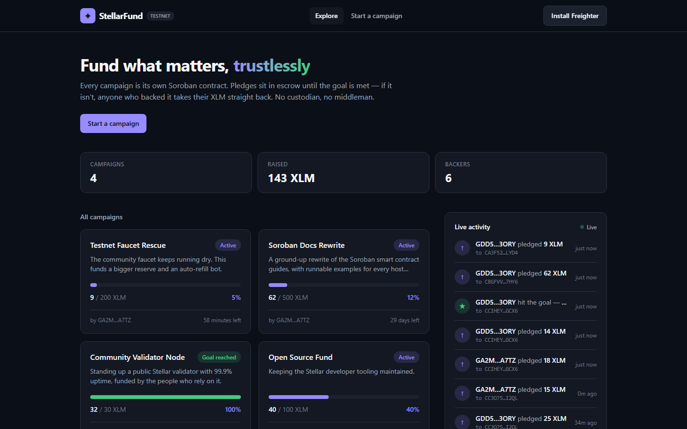
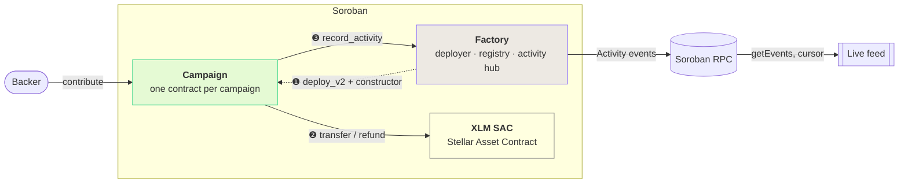
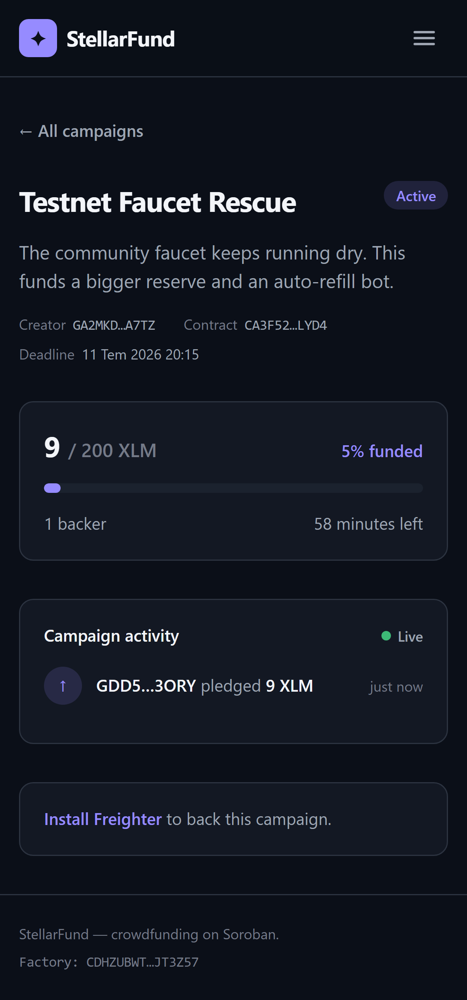
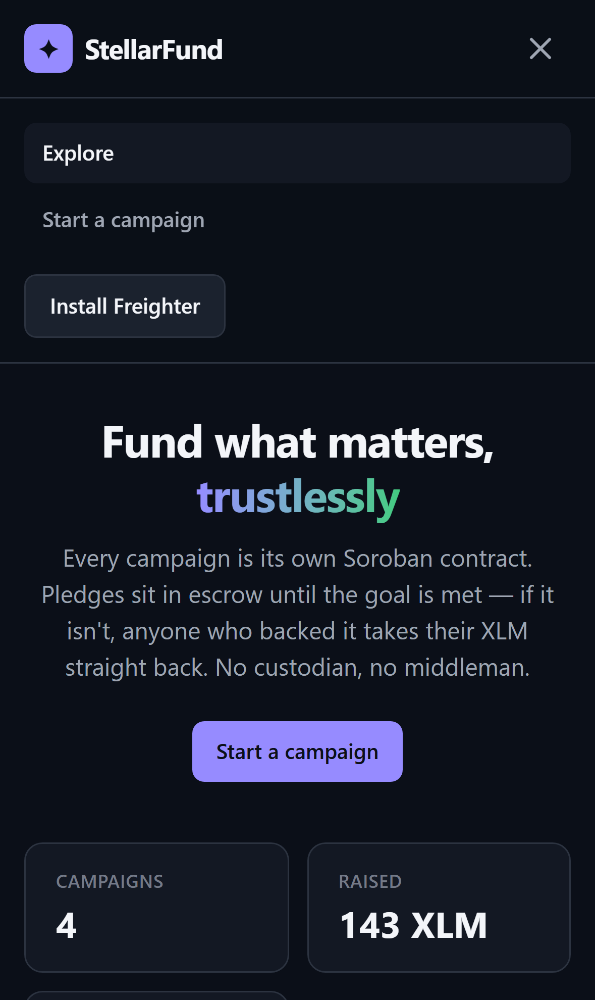
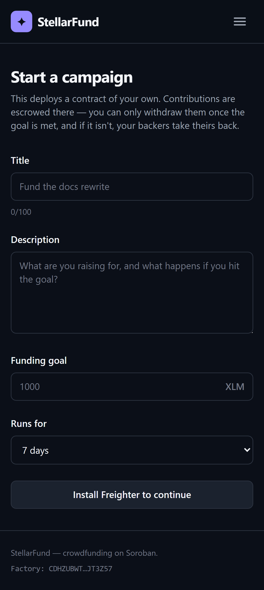
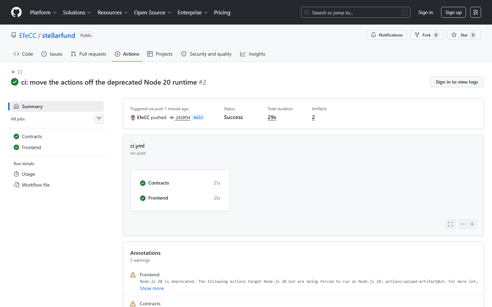
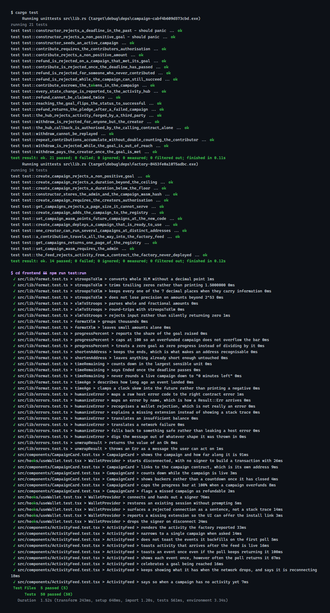

<div align="center">

# ✦ StellarFund

**Crowdfunding on Soroban. Every campaign is its own smart contract.**

Pledges sit in escrow until the goal is met. If it isn't, every backer takes their XLM straight back — no custodian, no middleman, no trust required.

[](../../actions/workflows/ci.yml)
[](https://stellar.expert/explorer/testnet/contract/CDHZUBWTRT53NQKJKJCOXWKM5BITXPYYHWKLQYWQNKJMVNNXDPJT3Z57)
[](docs/test-output.txt)
[](LICENSE)

**[Live demo](https://stellarfund-blush.vercel.app) · [Demo video](#) · [Factory contract](https://stellar.expert/explorer/testnet/contract/CDHZUBWTRT53NQKJKJCOXWKM5BITXPYYHWKLQYWQNKJMVNNXDPJT3Z57)**

<!-- TODO: replace the `#` above with the demo video link. -->

*Reviewing this? Every requirement maps to a file or a link in the
**[submission checklist](#submission-checklist)** at the bottom.*



</div>

---

## What it is

A crowdfunding platform where the escrow is the contract, not a company. A creator deploys a
campaign; backers pledge XLM into it; the money resolves one of exactly two ways, and nobody —
including us — can move it any other way:

- **The goal is met** → the creator withdraws.
- **The deadline passes without the goal** → every backer claims their pledge back, in full.

## Architecture

Three contracts, three separate kinds of inter-contract call.



### ❶ Factory → Campaign — deployment

`create_campaign` instantiates a campaign from an uploaded wasm hash and runs its constructor in the
**same host call**. A campaign is therefore never observable in a half-initialised state, and every
campaign on the platform provably runs the same code. The deployment salt is `sha256(creator ‖ index)`,
so one creator can run many campaigns without collision and can precompute their next address.

### ❷ Campaign → Token — escrow

Contributions are pulled into the campaign contract with `token::transfer`, and paid out the same
way. XLM on Soroban is an ordinary token contract, so the campaign has no special case for it.

### ❸ Campaign → Factory — the activity hub

**This one is the reason the live feed works.** Every campaign calls `record_activity` back on the
factory whenever its state changes, and the factory re-emits it as an `Activity` event.

Why bother, when the campaign already emits its own events? Because Soroban RPC's `getEvents` accepts
only a handful of contract ids per filter, and the number of campaigns is unbounded. A client cannot
subscribe to "every campaign" by watching the campaign contracts. Routing activity through the
factory gives the frontend **one contract id to stream the entire platform from.**

The factory authorises those callbacks with `campaign.require_auth()`. Soroban grants a contract
authorisation over its own address for calls it makes itself, so a genuine campaign passes — and an
external account trying to inject a fake contribution into the feed cannot produce that
authorisation. Both halves of that are pinned by tests
([`the_hub_callback_is_authorised_by_the_calling_contract_alone`](contracts/campaign/src/test.rs),
[`the_hub_rejects_activity_forged_by_a_third_party`](contracts/campaign/src/test.rs)).

### Campaign lifecycle

Status is **derived** from storage, never stored. A stored status would go stale the instant the
ledger clock crossed the deadline with no transaction there to update it.

```
                          raised ≥ goal
        ┌──────────────────────────────────────▶ Successful ──withdraw()──▶ Withdrawn
        │
     Active
        │
        └──────────────────────────────────────▶ Failed ──refund()──▶ (backers made whole)
              now ≥ deadline  &&  raised < goal
```

## Deployed on testnet

| | |
|---|---|
| **Factory** | [`CDHZUBWTRT53NQKJKJCOXWKM5BITXPYYHWKLQYWQNKJMVNNXDPJT3Z57`](https://stellar.expert/explorer/testnet/contract/CDHZUBWTRT53NQKJKJCOXWKM5BITXPYYHWKLQYWQNKJMVNNXDPJT3Z57) |
| **Campaign wasm hash** | `05c9dbd421355964fc54c68db51547c3d331c361fe6b13102987a5ee63c0e861` |
| **XLM SAC** | [`CDLZFC3SYJYDZT7K67VZ75HPJVIEUVNIXF47ZG2FB2RMQQVU2HHGCYSC`](https://stellar.expert/explorer/testnet/contract/CDLZFC3SYJYDZT7K67VZ75HPJVIEUVNIXF47ZG2FB2RMQQVU2HHGCYSC) |
| **Admin** | [`GDD5YXT3WW6GOGGTVCTP6TXGR2B7OWKK247KYCWXRUSMOZ2TOJU73ORY`](https://stellar.expert/explorer/testnet/account/GDD5YXT3WW6GOGGTVCTP6TXGR2B7OWKK247KYCWXRUSMOZ2TOJU73ORY) |

### Transactions

| What | Hash |
|---|---|
| **Deploy a campaign** (factory → campaign, inter-contract ❶) | [`2fe97bb355a21b191fc64379ca5790d77a5c63e53fd55d66311e92e1b7a9a6c0`](https://stellar.expert/explorer/testnet/tx/2fe97bb355a21b191fc64379ca5790d77a5c63e53fd55d66311e92e1b7a9a6c0) |
| **Contribute** (campaign → token → factory, ❷ and ❸ in one tx) | [`83891dc91bc552c2b86758e4374a3e9e7b19eb30d43d3a5bc25c74b9abd3b2a4`](https://stellar.expert/explorer/testnet/tx/83891dc91bc552c2b86758e4374a3e9e7b19eb30d43d3a5bc25c74b9abd3b2a4) |

The contribution transaction emits all three events in sequence — the SAC's `transfer`, the
campaign's `Contributed`, and the factory's `activity` — which is the whole chain working on a real
network, not just in tests.

### Live campaigns

| Campaign | Contract |
|---|---|
| Open Source Fund | [`CC3O752I…7I2QL`](https://stellar.expert/explorer/testnet/contract/CC3O752IQUHES6SSNARFCTRQSOJJWNUI7FCTGNI2STVNPTGB7OI7I2QL) |
| Community Validator Node (goal reached) | [`CCIHEYG6…DGCX6`](https://stellar.expert/explorer/testnet/contract/CCIHEYG6BV7WZ4346O43PGFCPOZJYDWFRL6MQDI6ZW47XKNU4CBDGCX6) |
| Soroban Docs Rewrite | [`CBGFVVXF…M7HY6`](https://stellar.expert/explorer/testnet/contract/CBGFVVXFD2ZVFEBPKTFU6PTIFK4JYGRXK3HTOQSPMRH7LREN6BQM7HY6) |
| Testnet Faucet Rescue (1h deadline — goes refundable) | [`CA3F52PI…CLYD4`](https://stellar.expert/explorer/testnet/contract/CA3F52PIW2WGPFIQ37Q2O3S7Q3SEH4633DS4DVPWMWOJB5GR5M6CLYD4) |

## Screenshots

Captured from the app running against the live testnet deployment above — the numbers in them are
real on-chain state, not mock data.

### Mobile

| Campaign | Navigation | Create |
|---|---|---|
|  |  |  |

### CI



### Tests



## Running it

**Prerequisites:** Rust 1.97+ with the `wasm32v1-none` target, [Stellar CLI 27](https://github.com/stellar/stellar-cli), Node 20+, and
[Freighter](https://www.freighter.app/) in your browser.

```sh
# Contracts: build the wasm, then run the suite.
make test

# Frontend
cd frontend
npm ci
npm run dev
```

The frontend reads its contract addresses from [`frontend/src/config/deployment.json`](frontend/src/config/deployment.json),
which is already pointed at the live testnet deployment above — so `npm run dev` works out of the
box, with no environment variables to set.

### Deploying your own

```sh
stellar keys generate deployer --network testnet --fund

./scripts/deploy.sh      # uploads the campaign wasm, deploys a factory, rewrites deployment.json
./scripts/bindings.sh    # regenerates the typed TS clients from the new contracts
```

Or run the **Deploy contracts** workflow from the Actions tab, which does the same thing on a runner
and commits the resulting addresses.

## Testing

**84 tests.** Full output: [`docs/test-output.txt`](docs/test-output.txt).

| Suite | Count | Run |
|---|---|---|
| Contracts | 35 | `make test` |
| Frontend | 49 | `cd frontend && npm run test:run` |
| Live testnet smoke | 3 | `cd frontend && npm run test:live` |

The contract tests are worth a look. The factory's tests **deploy the real compiled campaign wasm**
rather than a Rust stub, so they exercise the same `deploy_v2` path as testnet does — including
[one that follows a contribution all the way through the token contract and back into the factory's
feed](contracts/factory/src/test.rs).

The frontend's feed tests drive the real polling pipeline against a mocked RPC and pin the things
that are easy to regress: the first poll backfills history *without* firing a toast for every
historical event, a repeated event renders once, and a dropped network leaves the feed on screen
saying "Reconnecting" rather than blanking it.

The **live** suite is separate on purpose. It talks to the real deployment — proving the addresses in
`deployment.json` are alive and that the factory's events genuinely decode into the feed — but it is
kept out of CI, because a suite that goes red when someone else's RPC node has a bad minute is a
suite people learn to ignore.

## CI/CD

[`.github/workflows/ci.yml`](.github/workflows/ci.yml) — on every push and PR:

- **Contracts:** `cargo fmt --check` → `stellar contract build` → `cargo clippy -D warnings` → `cargo test`.
  The build comes before the tests deliberately: the factory tests need the compiled campaign wasm.
- **Frontend:** `oxlint --deny-warnings` → `tsc` → `vitest` → `vite build`.

[`.github/workflows/deploy-contracts.yml`](.github/workflows/deploy-contracts.yml) — manual, gated behind a
protected environment. Deploying on every push to `main` would strand the previous factory, and every
campaign in its registry, with nobody pointing at it.

The frontend deploys to Vercel on every push to `main`.

## Notes on the production choices

Things that were decided deliberately, and why:

- **Amounts are `bigint` end to end.** A campaign total can exceed `2^53`; a float round-trip would
  silently lose stroops. Conversion happens only at the edge, for display.
- **The registry is paged, not a `Vec`.** A single `Vec<Address>` instance entry would grow without
  bound and eventually exceed the entry size limit, bricking the factory. Campaigns get one
  persistent entry each and clients read a page at a time.
- **Contract errors are translated by name, not by number.** `Error(Contract, #6)` means different
  things in the two contracts. Anything unrecognised falls back to a plain sentence rather than
  leaking a host error at the user.
- **The wallet sits behind an interface.** Only Freighter is wired up, but every call site goes
  through `Wallet`, so a second adapter is a new implementation rather than a rewrite — and the tests
  drive the whole connection flow without a browser extension.
- **`@creit.tech/stellar-wallets-kit` was dropped** in favour of `@stellar/freighter-api`: the kit
  transitively pulls in the Solana wallet adapters, which brought 31 advisories (one critical) into a
  Stellar app. `npm audit` is clean.
- **No `rust-toolchain.toml`.** It pins the host triple as well as the version, which forces a Windows
  developer onto MSVC when their machine is set up for GNU. CI pins the toolchain explicitly instead.
- **The event feed is a cursor poll, not a subscription.** Soroban has no event push. Each pass asks
  only for what happened since the last one, and the cursor advances even on an empty page.
- **Contract state is the source of truth; the feed only says *when* to re-read it.** New activity
  bumps a revision counter, the campaign hooks refetch on it, and the numbers come back from
  `get_state` — so the UI can never drift from the chain.

## Layout

```
contracts/
  campaign/     escrow, goals, refunds — one instance per campaign
  factory/      deploys campaigns, registry, activity hub
frontend/
  src/contracts/    generated TS clients (scripts/bindings.sh)
  src/services/     RPC, wallet, transactions
  src/hooks/        wallet, live activity feed, campaign data
  src/pages/        explore · campaign · create
scripts/        deploy.sh · bindings.sh
```

## Submission checklist

| Requirement | Where |
|---|---|
| Public GitHub repository | [EfeCC/stellarfund](https://github.com/EfeCC/stellarfund) |
| README with complete documentation | this file |
| 10+ meaningful commits | [commit history](https://github.com/EfeCC/stellarfund/commits/main) |
| Live demo link | [stellarfund-blush.vercel.app](https://stellarfund-blush.vercel.app) |
| Contract deployment address | [`CDHZUBWT…JT3Z57`](https://stellar.expert/explorer/testnet/contract/CDHZUBWTRT53NQKJKJCOXWKM5BITXPYYHWKLQYWQNKJMVNNXDPJT3Z57) |
| Transaction hash for contract interaction | [`83891dc9…b3b2a4`](https://stellar.expert/explorer/testnet/tx/83891dc91bc552c2b86758e4374a3e9e7b19eb30d43d3a5bc25c74b9abd3b2a4) |
| Screenshot — mobile responsive UI | [above](#mobile) |
| Screenshot — CI/CD pipeline running | [above](#ci) |
| Screenshot — 3+ passing tests | [above](#tests) — 84, all named · raw output in [`docs/test-output.txt`](docs/test-output.txt) |
| Demo video (1–2 min) | *(see the header)* |
| Advanced smart contract development | [`contracts/`](contracts) — derived state machine, typed errors, TTL management, paged registry, admin upgrade path |
| Inter-contract communication | three distinct paths, [above](#architecture) |
| Event streaming & real-time updates | [factory activity hub](#-campaign--factory--the-activity-hub) → [cursor poll](frontend/src/hooks/useActivity.tsx) |
| CI/CD pipeline | [`.github/workflows/`](.github/workflows) |
| Contract deployment workflow | [`scripts/deploy.sh`](scripts/deploy.sh) + [manual deploy workflow](.github/workflows/deploy-contracts.yml) |
| Mobile responsive frontend | mobile-first Tailwind |
| Error handling & loading states | [`lib/errors.ts`](frontend/src/lib/errors.ts), [`ErrorBoundary`](frontend/src/components/ErrorBoundary.tsx), skeletons |
| Tests for contracts and frontend | 84 |

## License

MIT
